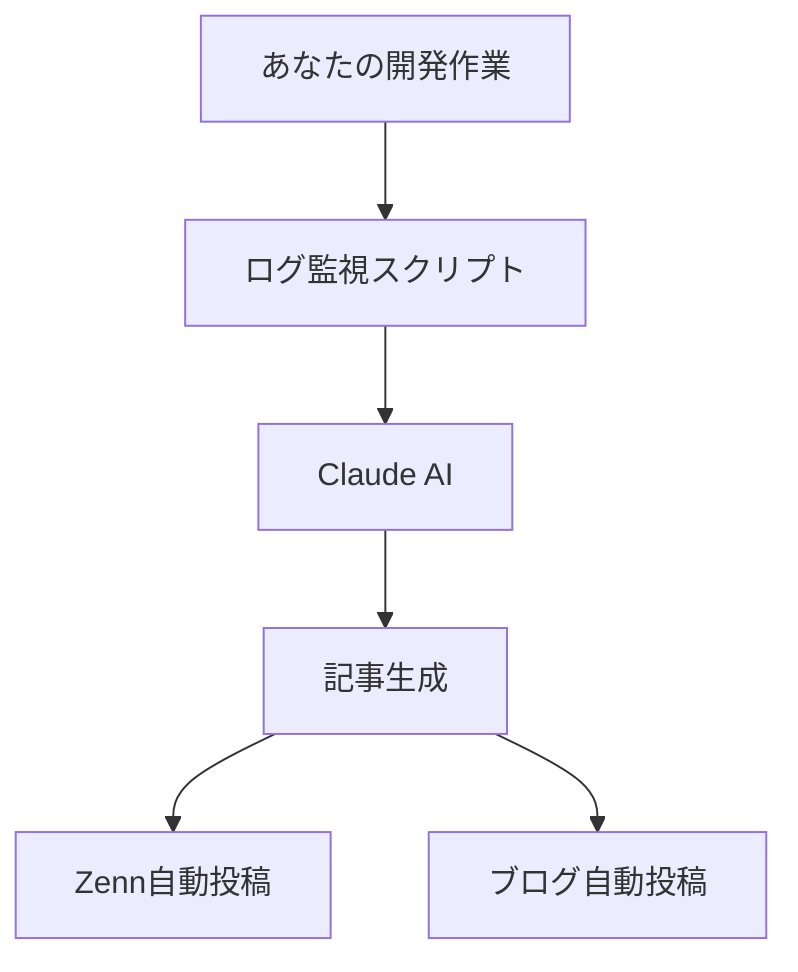

# WISDOM - 開発ログ自動記事化ツール

## 🎯 このツールは何をするの？

**あなたが開発作業をしているだけで、AIが自動で技術記事を書いてZennとブログに投稿してくれるツールです。**

### 📱 簡単な流れ
```
1. あなた: いつも通り開発作業（コーディング、Git操作など）
   ↓
2. ツール: 開発ログを自動監視・収集
   ↓ 
3. AI: ログを分析して技術記事を自動生成
   ↓
4. 自動投稿: Zenn + 個人ブログに同時投稿
```

## 🏗️ システム構成（超シンプル版）



## 📁 フォルダ構成

```
wisdom/
├── articles/                    # Zenn記事が自動生成される場所
├── automation/                  # 自動化スクリプト
│   ├── dev_log_watcher.py      # 開発ログ監視
│   ├── article_generator.py    # AI記事生成
│   └── auto_publisher.py       # 自動投稿
├── blog-app/                    # 個人ブログ
└── README.md                    # このファイル

# Obsidian（記録用）
/Users/dd/Library/Mobile Documents/iCloud~md~obsidian/Documents/
├── 01_Dev_Logs/                 # 開発ログが蓄積される
├── 02_Generated_Articles/       # 生成された記事の下書き
└── 03_Published_Content/        # 投稿済みコンテンツ
```

## 🚀 使い方（超簡単3ステップ）

### ステップ1: 初期設定（最初だけ）
```bash
# 1. 必要なツールをインストール
npm install
pip install -r requirements.txt

# 2. APIキーを設定（ClaudeのAPIキーが必要）
echo "ANTHROPIC_API_KEY=your_api_key_here" > .env

# 3. 自動監視を開始
python automation/dev_log_watcher.py
```

### ステップ2: 普通に開発する
- いつも通りコーディング
- Git commit/push
- ターミナルでの作業
- エラーの解決など

**何も特別なことはしなくてOK！**

### ステップ3: 記事が自動生成される
- 開発活動を検知してAIが記事作成
- Zennに自動投稿
- 個人ブログに自動投稿
- Obsidianに記録保存

## 🤖 AIが自動生成する記事の例

### 入力（あなたの開発ログ）
```
2025-01-22 15:30 - React useEffectでメモリリークが発生
2025-01-22 15:45 - useCallbackを使って解決
2025-01-22 16:00 - パフォーマンステストで効果確認
```

### 出力（AIが生成する記事）
```markdown
# Reactのメモリリーク問題をuseCallbackで解決した話

## 問題の発見
useEffectの依存配列でメモリリークが発生していました...

## 解決方法
useCallbackを使用して関数の再生成を防ぎました...

## 学んだこと
- useCallbackの適切な使用タイミング
- メモリリークの検出方法
- パフォーマンス最適化のベストプラクティス
```

## ⚙️ 設定カスタマイズ

### 記事生成の設定
```python
# automation/config.py
ARTICLE_GENERATION_CONFIG = {
    "min_log_entries": 5,           # 最低5つのログで記事生成
    "generation_interval": "daily",  # 毎日記事生成
    "article_style": "technical",   # 技術記事スタイル
    "target_length": 800,           # 800文字程度
    "include_code": True,           # コードブロック含む
    "auto_publish": True            # 自動投稿ON
}
```

### 監視対象の設定
```python
MONITORING_CONFIG = {
    "watch_folders": [
        "/Users/dd/Desktop/dev/",    # 開発フォルダ
        "/Users/dd/projects/"        # プロジェクトフォルダ  
    ],
    "git_repos": True,              # Git操作を監視
    "terminal_logs": True,          # ターミナル履歴監視
    "error_logs": True              # エラーログ監視
}
```

## 🎛️ 開始・停止コマンド

```bash
# 監視開始
python automation/dev_log_watcher.py

# 手動で記事生成
python automation/article_generator.py

# 設定確認  
python automation/check_config.py

# 停止
Ctrl+C
```

## 📊 ダッシュボード

Obsidianで自動生成されるダッシュボード:

### 1. 今日の開発アクティビティ
- Git commits: 5回
- エラー解決: 3件  
- 新機能実装: 1件

### 2. 生成待ちの記事
- React Hooks最適化 (80%完成)
- TypeScriptエラー解決手法 (準備中)

### 3. 投稿済みコンテンツ
- Zenn: 3記事投稿済み
- ブログ: 3記事投稿済み

## 🔧 トラブルシューティング

### Q: 記事が生成されない
A: ログの量が少ない可能性があります。`min_log_entries`の設定を下げてみてください。

### Q: 投稿に失敗する
A: APIキーの設定を確認してください。ZennとVercelの認証情報も必要です。

### Q: 記事の内容がイマイチ
A: プロンプトを調整できます。`automation/prompts.py`を編集してください。

## 🎯 こんな人におすすめ

- ✅ 技術ブログを書きたいけど時間がない
- ✅ 開発の学びを記録したい  
- ✅ Zennで発信を始めたい
- ✅ 自動化が大好き
- ✅ AIを活用したい

## 🚨 注意事項

- AIが生成した記事は必ず確認してから投稿
- 個人情報や機密情報が含まれないようチェック機能あり
- 生成された記事は編集・修正可能

---

## ✅ まとめ: これだけ覚えればOK

1. **最初だけ**: `npm install` → APIキー設定
2. **普段**: いつも通り開発するだけ
3. **結果**: 技術記事が自動で投稿される

**あなたはコードを書くだけ。記事執筆はAIにお任せ！** 🚀