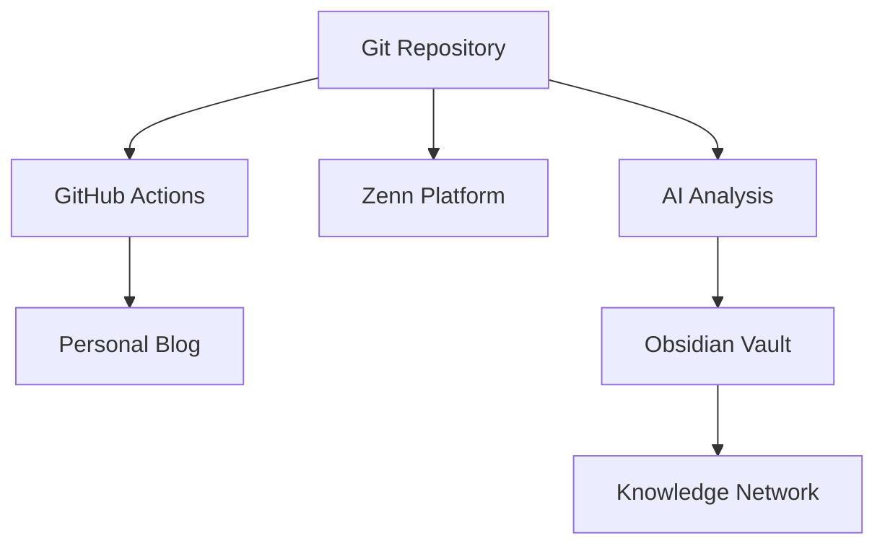

# WISDOM - 開発ログ自動記事化ツール

[](https://opensource.org/licenses/MIT)
[](https://www.python.org/downloads/)

**あなたが開発作業をしているだけで、AIが自動で技術記事を書いてZennとブログに投稿してくれるツールです。**

## ✨ 主な機能

### 📝 コンテンツ発信の自動化
- **Single Source of Truth**: Gitリポジトリから複数プラットフォームに自動展開
- **Zenn連携**: Zenn Connectによる公式同期
- **個人ブログ**: Astro + Vercelによる高速静的サイト生成
- **GitHub Actions**: 完全自動化されたデプロイパイプライン

### 🧠 AI拡張知識管理システム  
- **自動ノート生成**: GitコミットとログファイルからAIが洞察を抽出
- **Obsidian統合**: 既存の知識ベースと完全統合
- **意味的検索**: 概念的な関連性による高度な知識発見
- **ソクラテス的対話**: AIとの対話による思考の深化

## 🏗️ システム構成



## 🚀 クイックスタート

### 1. 環境構築

```bash
# リポジトリのクローン
git clone git@github.com:daideguchi/wisdom.git
cd wisdom

# 依存関係のインストール
npm run setup
npm run python:setup

# Obsidian統合の設定
npm run obsidian:setup
```

### 2. 環境変数の設定

```bash
# .env ファイルを作成
cp .env.example .env

# 必要なAPIキーを設定
echo "ANTHROPIC_API_KEY=your_claude_api_key" >> .env
```

### 3. 開発サーバーの起動

```bash
# Zenn + Astro の同時起動
npm run dev

# Zenn プレビュー: http://localhost:8000
# Astro ブログ: http://localhost:4321
```

## 📁 プロジェクト構造

```
wisdom/
├── articles/                    # Zenn記事（情報源）
├── books/                       # Zenn Book
├── blog-app/                    # Astro静的サイト
├── automation/                  # AI自動化スクリプト
├── .github/workflows/           # CI/CDパイプライン
└── obsidian_integration_config.py  # Obsidian統合設定
```

### Obsidian Vault統合

```
/Users/dd/Library/Mobile Documents/iCloud~md~obsidian/Documents/
├── 00_POST_TOOL_Integration/    # 統合フォルダ  
│   └── Automated_Insights/      # AI生成ノート
├── 000_Clippings/              # 既存クリッピング
├── 02_kindle出版ノウハウ/        # KDPプロジェクト
└── 51_Udemy_AI副業講座/        # AI副業講座
```

## 🔄 ワークフロー

### コンテンツ発信フロー
1. `articles/`にMarkdownファイルを作成・編集
2. Gitにコミット・プッシュ
3. **自動実行**: Zenn ConnectがZennに同期
4. **自動実行**: GitHub ActionsがAstroサイトをVercelにデプロイ

### AI知識管理フロー  
1. Gitコミット・ログファイル変更を自動検知
2. Claude APIでコード・ログを分析
3. 構造化されたノートをObsidian Vaultに自動生成
4. ユーザーがレビュー・リンク付け・深化

## 🎯 使用技術

| カテゴリ | 技術 | 用途 |
|---------|------|------|
| **AI・分析** | Claude API | コード・ログ分析 |
| **知識管理** | Obsidian | ツェッテルカステン |
| **サイト生成** | Astro | 個人ブログ |  
| **コンテンツ** | Zenn CLI | Zenn連携 |
| **自動化** | GitHub Actions | CI/CD |
| **ホスティング** | Vercel | 静的サイト配信 |
| **言語** | Python, JavaScript | 自動化・Web |

## 📊 特徴的な機能

### プロンプトエンジニアリング
```yaml
Git分析プロンプト:
  Role: シニアソフトウェアエンジニア  
  Output: JSON構造化データ
  Focus: 学び、リスク、実用的洞察

ログ分析プロンプト:
  Role: シニアSRE
  Output: インシデント対応情報
  Focus: 根本原因、対処法、影響評価
```

### Obsidian統合
- **iCloud同期対応**: デバイス間での完全同期
- **既存知識ベース活用**: 蓄積された知識との統合
- **Smart Connections**: 意味的な関連性発見
- **Dataview**: 動的な知識ダッシュボード

## 🛠️ 利用可能なスクリプト

```bash
# 開発
npm run dev                    # Zenn + Astro 同時起動
npm run zenn:preview          # Zennプレビュー
npm run astro:dev             # Astro開発サーバー

# Python自動化
npm run python:harvester      # Git分析実行
npm run python:watcher        # ログ監視開始

# 新規コンテンツ作成
npm run zenn:new-article      # 新しいZenn記事
npm run zenn:new-book         # 新しいZenn Book

# 統合管理
npm run obsidian:setup        # Obsidian統合設定
```

## 🤝 コントリビューション

1. このリポジトリをフォーク
2. feature ブランチを作成 (`git checkout -b feature/amazing-feature`)
3. 変更をコミット (`git commit -m 'Add amazing feature'`)
4. ブランチにプッシュ (`git push origin feature/amazing-feature`)  
5. プルリクエストを作成

## 📄 ライセンス

このプロジェクトはMITライセンスの下で公開されています。詳細は [LICENSE](LICENSE) ファイルを参照してください。

## 📞 サポート

- **Issues**: [GitHub Issues](https://github.com/daideguchi/wisdom/issues)
- **詳細ドキュメント**: `PROJECT_MASTER_BLUEPRINT.md`

---

> **「第二の脳」を構築し、知識を知恵に変える旅を始めましょう** 🚀# GitHub Actions Test
