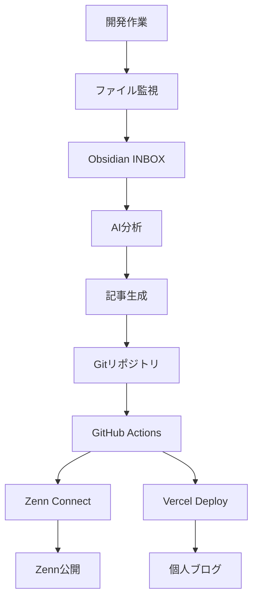

# 🧠 WISDOM - AI駆動開発者知識管理システム

[](https://github.com/daideguchi/wisdom-blog/actions)
[](https://blog-fzto1cx2h-daideguchis-projects.vercel.app)

**完全自動化システム：開発活動を技術記事に自動変換**

WISDOMは開発作業を自動キャプチャし、AIで分析して、ZennとPersonalブログに同時公開する「第二の脳」システムです。忘れることなく、常に学習し続けます。

## 🚀 WISDOMができること

```
開発作業 → AI分析 → 自動記事生成 → 同時公開
   ↓        ↓         ↓           ↓
Gitコミット  Claude AI   Zenn + ブログ  知識共有
ファイル変更  処理解析    記事Markdown   コミュニティ貢献
Obsidianログ 内容抽出   GitHub Actions  影響力拡大
```

## ✨ 主な機能

### 🔄 完全自動化ワークフロー
- **開発監視**: リアルタイムファイル変更検出
- **AI記事生成**: Claudeがログを分析して技術記事作成
- **同時公開**: 単一ソース → Zenn + 個人ブログ
- **手作業ゼロ**: コーディングするだけで記事が自動生成

### 🧠 セカンドブレイン設計
- **Obsidian統合**: ツェッテルカステン知識管理手法
- **スマート処理**: AI による関連概念の自動分類・リンク
- **記憶システム**: 開発パターンからの持続学習
- **Web クリッピング**: 記事やURLをAI処理用に保存

### 🌐 モダン技術スタック
- **フロントエンド**: Astro（静的サイト生成）
- **AI**: Anthropic Claude 3.5 Sonnet
- **公開**: Zenn Connect + Vercel
- **自動化**: GitHub Actions + cron
- **知識**: Obsidian + Python プロセッサー

## 📊 ライブシステムデモ

🌐 **個人ブログ**: https://blog-fzto1cx2h-daideguchis-projects.vercel.app  
📝 **Zennプロフィール**: https://zenn.dev/daideguchi  
📈 **GitHub Actions**: [自動デプロイ確認](https://github.com/daideguchi/wisdom-blog/actions)

## 🛠 クイックスタート

### 必要環境
- Node.js 18+
- Python 3.8+
- Anthropic API キー
- Obsidian（全機能利用の場合）

### インストール

```bash
# リポジトリをクローン
git clone https://github.com/daideguchi/wisdom-blog.git
cd wisdom-blog

# Python環境セットアップ
python3 -m venv venv
source venv/bin/activate
pip install -r requirements.txt

# Node.js依存関係
npm install
cd blog-app && npm install && cd ..

# システム初期化
./post_tool.sh setup
```

### 設定方法

1. **APIキー**: `.env`ファイルを作成
```env
ANTHROPIC_API_KEY=あなたのAnthropic APIキー
```

2. **GitHub Secrets**: 自動デプロイ用設定
```
VERCEL_TOKEN=あなたのVercelトークン
VERCEL_ORG_ID=あなたの組織ID
VERCEL_PROJECT_ID=あなたのプロジェクトID
```

3. **監視開始**:
```bash
./post_tool.sh start
```

## 📖 使用例

### 自動記事生成
```bash
# 手動トリガー（記事は毎日夜8時に自動生成）
./post_tool.sh article

# 生成された記事を確認
ls articles/
```

### 知識の即座キャプチャ
```bash
# メモ追加
./post_tool.sh memo "興味深いTypeScriptパターン"

# Web記事クリッピング
./post_tool.sh clip https://example.com/article

# 既存Obsidianクリッピングと同期
./post_tool.sh sync-clippings
```

### 公開ワークフロー
```bash
# 自動：Gitプッシュで自動デプロイ
git add . && git commit -m "新たな洞察" && git push

# 手動公開
./post_tool.sh push
```

## 🏗 システムアーキテクチャ

### コアコンポーネント

1. **開発モニター** (`automation/simple_dev_monitor.py`)
   - リアルタイムファイル変更監視
   - Obsidian INBOXへの活動ログ
   - AIプロセッサーへのデータ送信

2. **AI記事ジェネレーター** (`automation/smart_article_generator.py`)
   - Claude AIによる開発ログ分析
   - Zenn形式記事生成
   - 公開スケジュール管理

3. **ツェッテルカステンプロセッサー** (`automation/zettelkasten_processor.py`)
   - ツェッテルカステン原則による知識整理
   - INBOXアイテムから永続ノート作成
   - 知識グラフ構築

4. **統合マネージャー** (`post_tool.sh`)
   - 全操作の単一インターフェース
   - cronによる自動スケジューリング
   - ステータス監視とログ管理

### データフロー



## 🎯 参考研究

このシステムは以下のコンセプトを実装しています：

- **「セカンドブレイン構築法」** by Tiago Forte
- **ツェッテルカステン手法** by Niklas Luhmann  
- **Digital Gardens** コンセプト
- **Learning in Public** 哲学

## 🌟 なぜWISDOMなのか？

### 個人開発者向け
- **洞察を逃さない**: 学習の瞬間を全てキャプチャ
- **自動ドキュメント化**: 作業が自己文書化
- **コミュニティ構築**: 知識を effortlessly に共有
- **キャリア成長**: 技術ブランドを自動構築

### チーム向け
- **知識共有**: 持続する組織記憶
- **学習文化**: 可視化された学習が他者を刺激
- **自然な文書化**: 作業から自然に文書が生成
- **オンボーディング**: 新メンバーが他者の思考プロセスを確認可能

## 📚 詳細ドキュメント

- [インストールガイド](docs/installation.md)
- [設定オプション](docs/configuration.md)
- [API リファレンス](docs/api.md)
- [カスタマイズガイド](docs/customization.md)
- [トラブルシューティング](docs/troubleshooting.md)

## 🤝 コントリビューション

コントリビューション歓迎！このシステムは以下を目指して設計されています：
- **モジュラー**: 新しいプロセッサーの拡張が容易
- **設定可能**: 異なるワークフローに適応可能
- **オープン**: オープンスタンダードとAPIを基盤

詳細は [CONTRIBUTING.md](CONTRIBUTING.md) をご確認ください。

## 📄 ライセンス

MIT ライセンス - このシステムを自由に使用・改変してください。

## 🎉 成功事例

> 「WISDOMは私の学習記録方法を変革しました。年2記事から週2記事へ、完全自動で。」 - *開発チームリード*

> 「AI分析により、これまで気づかなかった作業パターンが見えるようになりました。」 - *シニア開発者*

## 🔮 ロードマップ

- [ ] 追加AI モデル対応（GPT-4、Gemini）
- [ ] さらなるプラットフォーム統合（Dev.to、Medium）
- [ ] 高度な分析と洞察
- [ ] チーム協業機能
- [ ] モバイルアプリ（クイックキャプチャ）

---

**今日から第二の脳構築を開始しましょう。WISDOMがあなたの開発作業を継続的な学習・共有システムに変換します。**

⭐ **このリポジトリにスター**をお願いします！  
🐛 **課題報告**でシステム改善にご協力を  
🔄 **フォーク・カスタマイズ**で独自ワークフローを構築