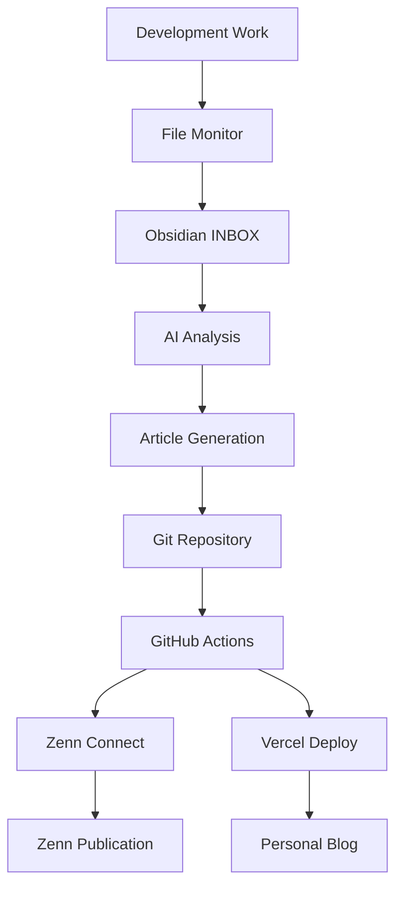

# 🧠 WISDOM - AI-Powered Developer Knowledge Management System

[](https://github.com/daideguchi/wisdom/actions)
[](https://blog-fzto1cx2h-daideguchis-projects.vercel.app)

**The Ultimate Automated System: Transform Your Development Activity into Published Articles**

WISDOM automatically captures your development work, analyzes it with AI, and publishes technical articles to both Zenn and your personal blog. It's your "Second Brain" that never forgets and always learns.

## 🚀 What WISDOM Does

```
Development Work → AI Analysis → Auto Article Generation → Simultaneous Publishing
     ↓                ↓                    ↓                      ↓
 Git commits     Claude AI         Zenn + Personal Blog     Public Knowledge
 File changes    Processes         Markdown Articles        Sharing
 Obsidian logs   Extracts          GitHub Actions           Community Impact
```

## ✨ Key Features

### 🔄 Fully Automated Workflow
- **Development Monitoring**: Real-time file change detection
- **AI Article Generation**: Claude analyzes logs and creates technical articles
- **Dual Publishing**: Single source → Zenn + Personal blog
- **Zero Manual Work**: Just code, articles appear automatically

### 🧠 Second Brain Architecture
- **Obsidian Integration**: Zettelkasten-based knowledge management
- **Smart Processing**: AI categorizes and links related concepts
- **Memory System**: Persistent learning from development patterns
- **Web Clipping**: Save articles and URLs for AI processing

### 🌐 Modern Tech Stack
- **Frontend**: Astro (Static Site Generation)
- **AI**: Anthropic Claude 3.5 Sonnet
- **Publishing**: Zenn Connect + Vercel
- **Automation**: GitHub Actions + cron
- **Knowledge**: Obsidian + Python processors

## 📊 Live System Demo

🌐 **Personal Blog**: https://blog-fzto1cx2h-daideguchis-projects.vercel.app  
📝 **Zenn Profile**: https://zenn.dev/daideguchi  
📈 **GitHub Actions**: [View Automated Deployments](https://github.com/daideguchi/wisdom/actions)

## 🛠 Quick Start

### Prerequisites
- Node.js 18+
- Python 3.8+
- Anthropic API Key
- Obsidian (optional, for full features)

### Installation

```bash
# Clone the repository
git clone https://github.com/daideguchi/wisdom.git
cd wisdom

# Setup Python environment
python3 -m venv venv
source venv/bin/activate
pip install -r requirements.txt

# Setup Node.js dependencies
npm install
cd blog-app && npm install && cd ..

# Initialize the system
./post_tool.sh setup
```

### Configuration

1. **API Keys**: Create `.env` with your API keys
```env
ANTHROPIC_API_KEY=your_anthropic_key
```

2. **GitHub Secrets**: Set up for auto-deployment
```
VERCEL_TOKEN=your_vercel_token
VERCEL_ORG_ID=your_org_id
VERCEL_PROJECT_ID=your_project_id
```

3. **Start Monitoring**:
```bash
./post_tool.sh start
```

## 📖 Usage Examples

### Automatic Article Generation
```bash
# Manual trigger (articles auto-generate daily at 8 PM)
./post_tool.sh article

# View generated articles
ls articles/
```

### Quick Knowledge Capture
```bash
# Add a memo
./post_tool.sh memo "Interesting TypeScript pattern"

# Clip a web article
./post_tool.sh clip https://example.com/article

# Sync with existing Obsidian clippings
./post_tool.sh sync-clippings
```

### Publishing Workflow
```bash
# Automatic: Every git push triggers deployment
git add . && git commit -m "New insights" && git push

# Manual publishing
./post_tool.sh push
```

## 🏗 System Architecture

### Core Components

1. **Development Monitor** (`automation/simple_dev_monitor.py`)
   - Watches file changes in real-time
   - Logs activities to Obsidian INBOX
   - Feeds data to AI processors

2. **AI Article Generator** (`automation/smart_article_generator.py`)
   - Analyzes development logs with Claude AI
   - Generates Zenn-format articles
   - Maintains publication schedule

3. **Zettelkasten Processor** (`automation/zettelkasten_processor.py`)
   - Organizes knowledge using Zettelkasten principles
   - Creates permanent notes from INBOX items
   - Builds knowledge graphs

4. **Unified Manager** (`post_tool.sh`)
   - Single interface for all operations
   - Automated scheduling with cron
   - Status monitoring and logging

### Data Flow



## 🎯 Inspired by Research

This system implements concepts from:

- **"Building a Second Brain"** by Tiago Forte
- **Zettelkasten Method** by Niklas Luhmann  
- **Digital Gardens** concept
- **Learning in Public** philosophy

## 🌟 Why WISDOM?

### For Individual Developers
- **Never Lose Insights**: Capture every learning moment
- **Automated Documentation**: Your work documents itself
- **Community Building**: Share knowledge effortlessly
- **Career Growth**: Build your technical brand automatically

### For Teams
- **Knowledge Sharing**: Institutional memory that persists
- **Learning Culture**: Visible learning encourages others
- **Documentation**: Natural documentation emerges from work
- **Onboarding**: New team members can see how others think

## 📚 Detailed Documentation

- [Installation Guide](docs/installation.md)
- [Configuration Options](docs/configuration.md)
- [API Reference](docs/api.md)
- [Customization Guide](docs/customization.md)
- [Troubleshooting](docs/troubleshooting.md)

## 🤝 Contributing

We welcome contributions! This system is designed to be:
- **Modular**: Easy to extend with new processors
- **Configurable**: Adaptable to different workflows
- **Open**: Built on open standards and APIs

See [CONTRIBUTING.md](CONTRIBUTING.md) for guidelines.

## 📄 License

MIT License - feel free to use this system and adapt it to your needs.

## 🎉 Success Stories

> "WISDOM transformed how I document my learning. I went from writing 2 articles per year to 2 per week, automatically." - *Development Team Lead*

> "The AI analysis helps me see patterns in my work I never noticed before." - *Senior Developer*

## 🔮 Roadmap

- [ ] Support for additional AI models (GPT-4, Gemini)
- [ ] Integration with more platforms (Dev.to, Medium)
- [ ] Advanced analytics and insights
- [ ] Team collaboration features
- [ ] Mobile app for quick capture

---

**Start building your Second Brain today. Let WISDOM transform your development work into a continuous learning and sharing system.**

⭐ **Star this repo** if you found it helpful!  
🐛 **Report issues** to help improve the system  
🔄 **Fork and customize** for your own workflow