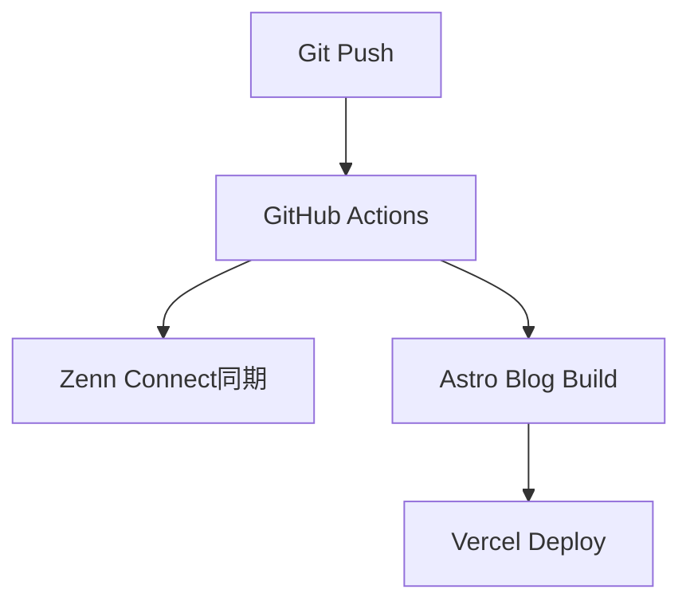

# WISDOM自動記事生成システムのテスト

このテスト記事は、Git→Zenn+個人ブログ同時展開システムの動作確認のために作成されました。

## 🎯 システム概要

WISDOMシステムは以下の要素で構成されています：

- **Single Source of Truth**: GitリポジトリのMarkdownファイル
- **Zenn Connect**: 自動Zenn同期
- **Astro Blog**: 個人ブログ生成
- **GitHub Actions**: 自動デプロイパイプライン
- **Vercel**: 個人ブログホスティング

## 🔄 ワークフロー

## 📝 テスト項目

1. ✅ Zenn CLI記事作成
2. ✅ Astroブログ記事表示
3. ⏳ GitHub Actions実行
4. ⏳ Zenn Connect同期
5. ⏳ Vercelデプロイ

## 🚀 期待される結果

この記事がgit pushされると：
- Zennに自動同期される
- 個人ブログに表示される
- GitHub Actionsが実行される

## まとめ

このテストが成功すれば、完全自動化された知識管理・記事公開システムが完成します。
