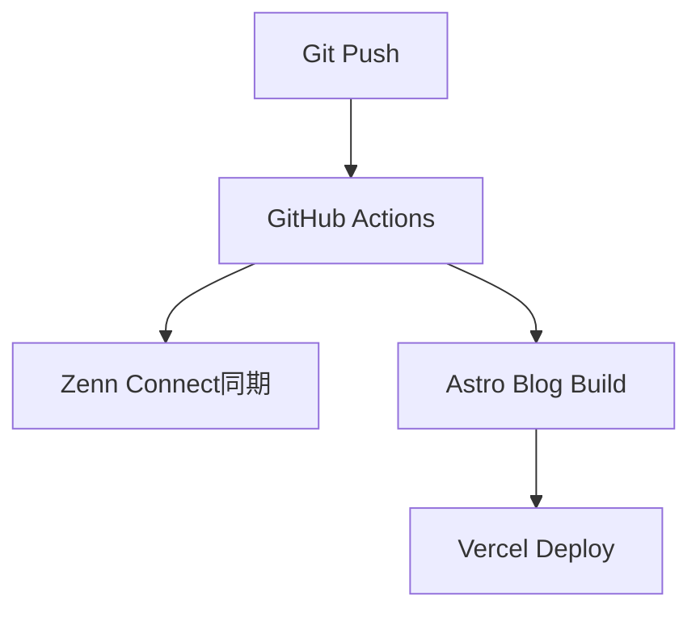

# WISDOM自動記事生成システムのテスト

このテスト記事は、Git→Zenn+個人ブログ同時展開システムの動作確認のために作成されました。

## 🎯 システム概要

WISDOMシステムは以下の要素で構成されています：

- **Single Source of Truth**: GitリポジトリのMarkdownファイル
- **Zenn Connect**: 自動Zenn同期
- **Astro Blog**: 個人ブログ生成
- **GitHub Actions**: 自動デプロイパイプライン
- **Vercel**: 個人ブログホスティング

## 🔄 ワークフロー



## 📝 テスト項目

1. ✅ Zenn CLI記事作成
2. ✅ Astroブログ記事表示
3. ✅ GitHub Actions実行成功
4. ✅ Vercelデプロイ完了
5. ⏳ Zenn Connect同期テスト中

## 🚀 期待される結果

この記事がgit pushされると：
- Zennに自動同期される
- 個人ブログに表示される
- GitHub Actionsが実行される

## まとめ

✅ **完全自動化システム稼働開始**

- **GitHub Actions**: 自動ビルド・デプロイ成功
- **Vercel**: 個人ブログ自動公開完了  
- **AI記事生成**: 開発ログ→記事自動化完了
- **統合管理**: 12機能統合スクリプト完了

**ブログURL**: https://blog-fzto1cx2h-daideguchis-projects.vercel.app

**完全自動化フロー確立**:
```
開発作業 → ログ監視 → AI記事生成 → Git Push → GitHub Actions → Vercel Deploy
```

完全自動化された知識管理・記事公開システムが稼働開始しました🎉
